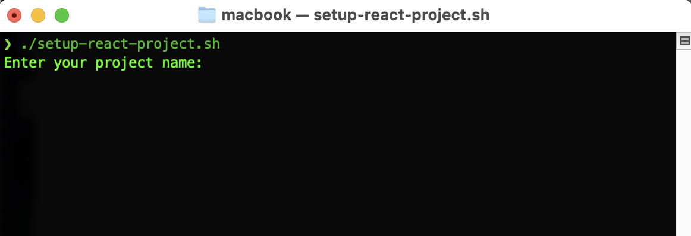
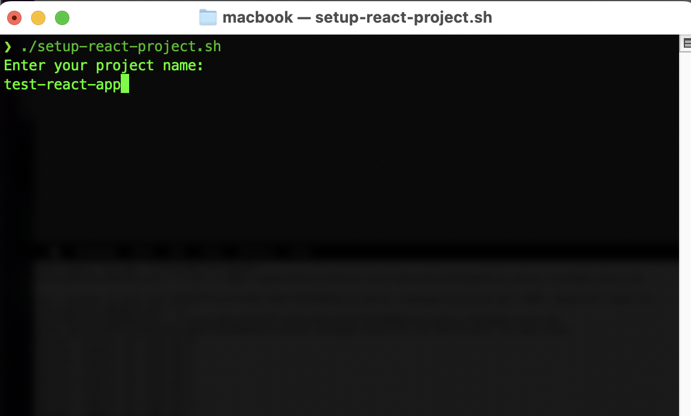
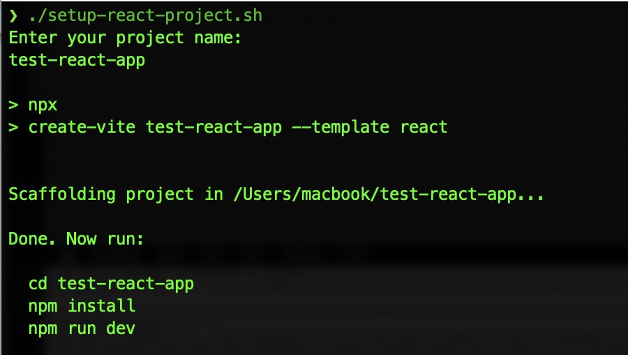
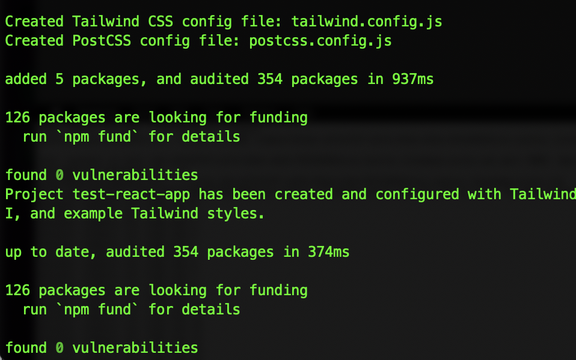

# React Project Setup Script

This script automates the creation of a new React project with Vite, Tailwind CSS, and DaisyUI. It removes the default CSS files, sets up Tailwind CSS, and starts a local development server.

## Prerequisites

Before you begin, ensure you have the following installed:
- [Node.js](https://nodejs.org/)
- [npm](https://www.npmjs.com/)

## Installation

#### Clone this repository:
```bash
git clone https://github.com/stevenrhett/react-setup-script.git
```

#### Navigate into the project directory:
```bash
cd react-setup-script
 ```


#### Make the script executable:
```bash
 chmod +x setup-react-project.sh
```

## Usage

#### Run the script to create a new project:
```bash
./setup-react-project.sh
```

#### You will be prompted to enter the project name. The script will set up the project, install dependencies, and start the development server.

## Example
```bash
./setup-react-project.sh
Enter your project name: my-new-project
```


#### This will:

* Create a new Vite + React project
* Set up Tailwind CSS and DaisyUI
* Install all dependencies 
* Start the development server at `http://localhost:5173`



## License
This project is licensed under the MIT License.
