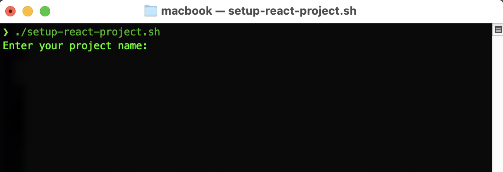
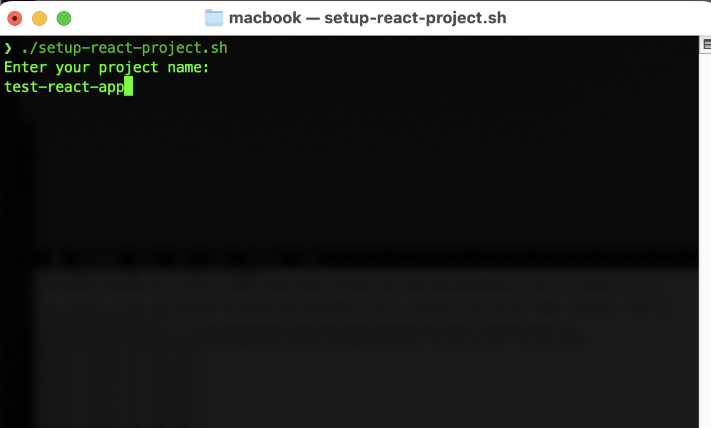
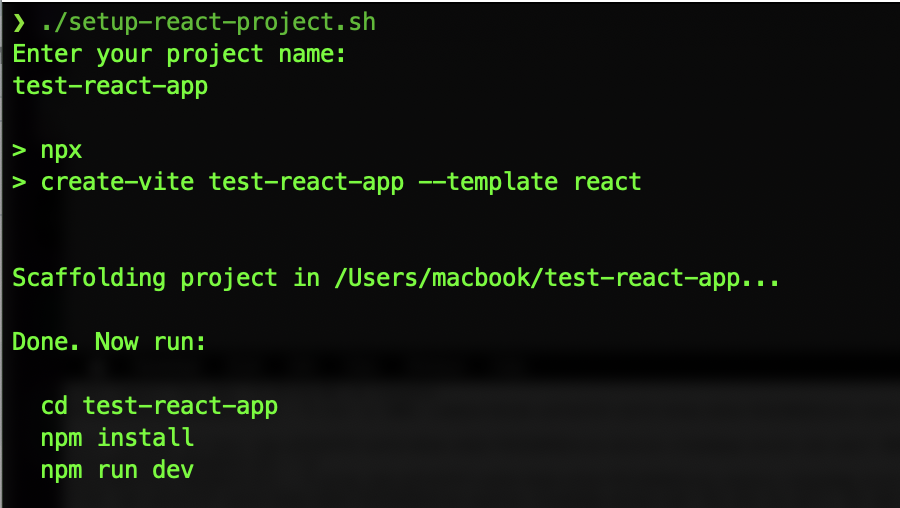
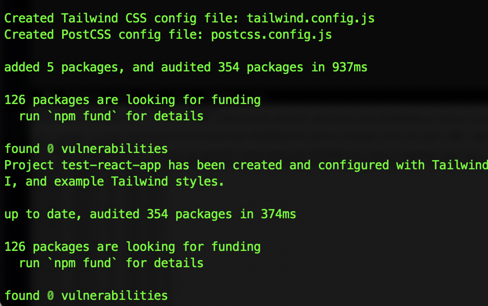

# React Setup Script 🚀

[](https://opensource.org/licenses/MIT)
[](https://nodejs.org/)

**A production-ready automation script for setting up modern React projects with Vite, Tailwind CSS, and DaisyUI in seconds.**

This tool is designed for developers who want to quickly bootstrap React projects with a modern, pre-configured tech stack. Perfect for prototyping, learning, or starting new projects without the repetitive setup work.

---

## Table of Contents

- [Features](#features)
- [What This Script Does](#what-this-script-does)
- [Prerequisites](#prerequisites)
- [Quick Start](#quick-start)
- [Detailed Installation](#detailed-installation)
- [Usage](#usage)
- [Project Structure](#project-structure)
- [What's Included](#whats-included)
- [Customization](#customization)
- [Troubleshooting](#troubleshooting)
- [FAQ](#faq)
- [Documentation](#documentation)
- [Contributing](#contributing)
- [License](#license)

---

## Features

✅ **Automated Setup** - Creates a complete React project with one command
✅ **Modern Tech Stack** - Vite, React, Tailwind CSS, DaisyUI
✅ **Zero Configuration** - Pre-configured and ready to code
✅ **Fast Development** - Vite's lightning-fast HMR (Hot Module Replacement)
✅ **Beautiful UI** - DaisyUI component library with 30+ themes
✅ **Production Ready** - Optimized build configuration out of the box

---

## What This Script Does

The script automates the following steps:

1. **Creates a Vite + React project** using the official Vite template
2. **Installs Tailwind CSS** with PostCSS and Autoprefixer
3. **Configures Tailwind** with proper content paths
4. **Installs DaisyUI** plugin for beautiful pre-built components
5. **Sets up initial styling** with Tailwind directives
6. **Creates a sample component** demonstrating Tailwind and DaisyUI
7. **Installs all dependencies** automatically
8. **Starts the development server** on `http://localhost:5173`

All in under 2 minutes! ⚡

---

## Prerequisites

Before using this script, ensure you have the following installed on your system:

### Required

- **Node.js** (version 16.0.0 or higher)
  - Download: [https://nodejs.org/](https://nodejs.org/)
  - Check version: `node --version`

- **npm** (usually comes with Node.js)
  - Check version: `npm --version`
  - Minimum version: 7.0.0 or higher

### Optional

- **Git** (for cloning the repository)
  - Download: [https://git-scm.com/](https://git-scm.com/)

### System Requirements

- **Operating System**: Linux, macOS, or Windows (with Git Bash/WSL)
- **Disk Space**: At least 500MB free space for dependencies
- **Internet Connection**: Required for downloading packages

---

## Quick Start

```bash
# Clone the repository
git clone https://github.com/stevenrhett/react-setup-script.git

# Navigate to the directory
cd react-setup-script

# Make the script executable (Linux/macOS)
chmod +x setup-react-project.sh

# Run the script
./setup-react-project.sh

# Enter your project name when prompted
# Example: my-awesome-app
```

That's it! Your development server will start automatically at `http://localhost:5173` 🎉

---

## Detailed Installation

### Step 1: Clone the Repository

```bash
git clone https://github.com/stevenrhett/react-setup-script.git
```

### Step 2: Navigate to the Directory

```bash
cd react-setup-script
```

### Step 3: Make the Script Executable

**On Linux/macOS:**
```bash
chmod +x setup-react-project.sh
```

**On Windows:**
- Use Git Bash or WSL (Windows Subsystem for Linux)
- Or run with: `bash setup-react-project.sh`

### Step 4: Run the Script

```bash
./setup-react-project.sh
```

---

## Usage

### Basic Usage

Run the script and follow the prompts:

```bash
./setup-react-project.sh
```



**You will be asked:**
```
Enter your project name:
```

**Enter your desired project name:**
```
my-new-project
```



### What Happens Next

The script will:

1. Create a new directory with your project name
2. Initialize a Vite + React project
3. Install Tailwind CSS, PostCSS, and Autoprefixer
4. Configure Tailwind CSS
5. Install and configure DaisyUI
6. Set up example code
7. Install all dependencies
8. Start the development server



### Development Server

Once complete, your app will be running at:
```
http://localhost:5173
```



### Project Naming Guidelines

**Valid project names:**
- `my-app`
- `awesome-project`
- `my_cool_app`
- `project123`

**Invalid project names:**
- `My App` (spaces not allowed)
- `my/app` (special characters not allowed)
- `123project` (cannot start with numbers)

---

## Project Structure

After running the script, your project will have this structure:

```
my-new-project/
├── node_modules/         # Dependencies (auto-generated)
├── public/               # Static assets
├── src/
│   ├── App.jsx          # Main component (with Tailwind example)
│   ├── index.css        # Tailwind directives
│   └── main.jsx         # Application entry point
├── index.html           # HTML template
├── package.json         # Project dependencies and scripts
├── postcss.config.js    # PostCSS configuration
├── tailwind.config.js   # Tailwind CSS configuration
├── vite.config.js       # Vite configuration
└── .gitignore           # Git ignore file
```

---

## What's Included

### Tech Stack

| Technology | Version | Purpose |
|------------|---------|---------|
| **React** | Latest | UI Library |
| **Vite** | Latest | Build tool and dev server |
| **Tailwind CSS** | Latest | Utility-first CSS framework |
| **DaisyUI** | Latest | Component library for Tailwind |
| **PostCSS** | Latest | CSS transformation |
| **Autoprefixer** | Latest | Vendor prefix automation |

### Configuration Files

- **`vite.config.js`** - Vite build configuration
- **`tailwind.config.js`** - Tailwind CSS with DaisyUI plugin
- **`postcss.config.js`** - PostCSS with Tailwind and Autoprefixer
- **`package.json`** - Dependencies and scripts

### Available Scripts

After setup, you can use these npm scripts:

```bash
# Start development server
npm run dev

# Build for production
npm run build

# Preview production build
npm run preview

# Lint code (if ESLint is configured)
npm run lint
```

---

## Customization

### Changing the Default Component

Edit `src/App.jsx` after project creation:

```jsx
function App() {
  return (
    <div className="min-h-screen bg-base-200 flex items-center justify-center">
      <div className="card w-96 bg-base-100 shadow-xl">
        <div className="card-body">
          <h2 className="card-title">Your Custom Content</h2>
          <p>Start building your app here!</p>
        </div>
      </div>
    </div>
  );
}

export default App;
```

### Tailwind Configuration

Modify `tailwind.config.js` to customize your theme:

```javascript
export default {
  content: [
    "./index.html",
    "./src/**/*.{js,ts,jsx,tsx}",
  ],
  theme: {
    extend: {
      colors: {
        'custom-blue': '#1E40AF',
      },
    },
  },
  plugins: [require("daisyui")],
  daisyui: {
    themes: ["light", "dark", "cupcake"], // Add your preferred themes
  },
}
```

### DaisyUI Themes

DaisyUI comes with 30+ built-in themes. To use them:

```html
<!-- In your HTML -->
<html data-theme="dracula">
```

Available themes: `light`, `dark`, `cupcake`, `bumblebee`, `emerald`, `corporate`, `synthwave`, `retro`, `cyberpunk`, `valentine`, `halloween`, `garden`, `forest`, `aqua`, `lofi`, `pastel`, `fantasy`, `wireframe`, `black`, `luxury`, `dracula`, and more!

---

## Troubleshooting

### Common Issues

#### Script Permission Denied

**Error:**
```
bash: ./setup-react-project.sh: Permission denied
```

**Solution:**
```bash
chmod +x setup-react-project.sh
```

#### Node.js Not Found

**Error:**
```
npm: command not found
```

**Solution:**
Install Node.js from [https://nodejs.org/](https://nodejs.org/)

#### Port Already in Use

**Error:**
```
Port 5173 is in use, trying another one...
```

**Solution:**
Vite will automatically try another port. Or kill the process using port 5173:

```bash
# Find process using port 5173
lsof -i :5173

# Kill the process
kill -9 <PID>
```

#### npm Install Fails

**Error:**
```
npm ERR! code ECONNREFUSED
```

**Solution:**
- Check your internet connection
- Try using a different npm registry:
```bash
npm config set registry https://registry.npmjs.org/
```
- Clear npm cache:
```bash
npm cache clean --force
```

### Getting Help

If you encounter issues:

1. Check the [FAQ](FAQ.md) section
2. Review the [Documentation](DOCS.md)
3. Search existing [GitHub Issues](https://github.com/stevenrhett/react-setup-script/issues)
4. Open a new issue with:
   - Your operating system
   - Node.js version (`node --version`)
   - npm version (`npm --version`)
   - Complete error message
   - Steps to reproduce

---

## FAQ

For frequently asked questions, see [FAQ.md](FAQ.md)

Common topics covered:
- Can I use TypeScript instead of JavaScript?
- How do I add more libraries?
- Can I modify the script for my needs?
- What if I don't want DaisyUI?
- How do I deploy my project?

---

## Documentation

For detailed technical documentation, see [DOCS.md](DOCS.md)

Topics covered:
- Understanding the Script
- Advanced Configuration
- Tailwind CSS Guide
- DaisyUI Component Library
- Vite Configuration
- Best Practices
- Performance Optimization

---

## Contributing

We welcome contributions! See [CONTRIBUTING.md](CONTRIBUTING.md) for guidelines.

Ways to contribute:
- Report bugs
- Suggest new features
- Improve documentation
- Submit pull requests
- Share your projects built with this script

---

## License

This project is licensed under the MIT License - see the [LICENSE](LICENSE) file for details.

**MIT License Summary:**
- ✅ Commercial use
- ✅ Modification
- ✅ Distribution
- ✅ Private use

---

## Acknowledgments

Built with:
- [React](https://react.dev/) - UI Library
- [Vite](https://vitejs.dev/) - Build Tool
- [Tailwind CSS](https://tailwindcss.com/) - CSS Framework
- [DaisyUI](https://daisyui.com/) - Component Library

---

## Author

**Steven Rhett**
- GitHub: [@stevenrhett](https://github.com/stevenrhett)
- Repository: [react-setup-script](https://github.com/stevenrhett/react-setup-script)

---

## Star History

If this project helped you, consider giving it a ⭐ on GitHub!

---

**Happy Coding! 💻✨**
